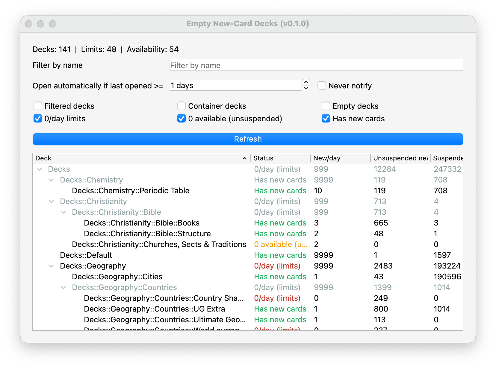

# Notify Empty Decks

Anki add-on for people with many decks who introduce new cards slowly.

## Who This Is For

This is mainly useful if:

- You have a large deck tree.
- You keep some decks or cards suspended until others are finished.
- You want to study a subject again once its deck runs out of new cards.
- You can go days or weeks before noticing a deck has no new cards left.

If that sounds familiar, this add-on helps you catch "silent" deck exhaustion quickly.

## The Problem It Solves

If you have dozens of decks, collection review is usually fast and high-level. In that mode, it is easy to miss that specific decks are no longer producing new cards.

The alternative is checking decks one-by-one in the browser, which is slow and tedious in large collections.

This add-on gives you one focused report so you can spot stalled decks quickly and decide what to unsuspend next.

## What You See

Open `Tools -> Find Empty New-Card Decks`.

You get a deck report with:

- Tree structure (parents + children).
- Status labels:
  - `0/day (limits)`
  - `0 available (unsuspended)`
  - `Has new cards`
- Columns for `New/day`, `Unsuspended new`, and `Suspended new`.
- Sortable columns.
- Name filtering that keeps parent context visible (non-matching context rows are muted gray).

## Typical Workflow

1. Study as usual.
2. Open this report when planning what to unsuspend next.
3. Check decks marked `0/day (limits)` or `0 available (unsuspended)`.
4. Unsuspend the next deck in your pipeline when needed.

## Install (From Source)

1. Clone this repository.
2. Copy or symlink it to your Anki addons folder as `notify-empty-decks`:
   - macOS example: `~/Library/Application Support/Anki2/addons21/notify-empty-decks`
3. Restart Anki.

## Notes

- Works in Anki's Qt6/PyQt6 environment (Anki 25.x).
- Advanced options are available in `config.json`, but most users can use the add-on without editing config manually.
